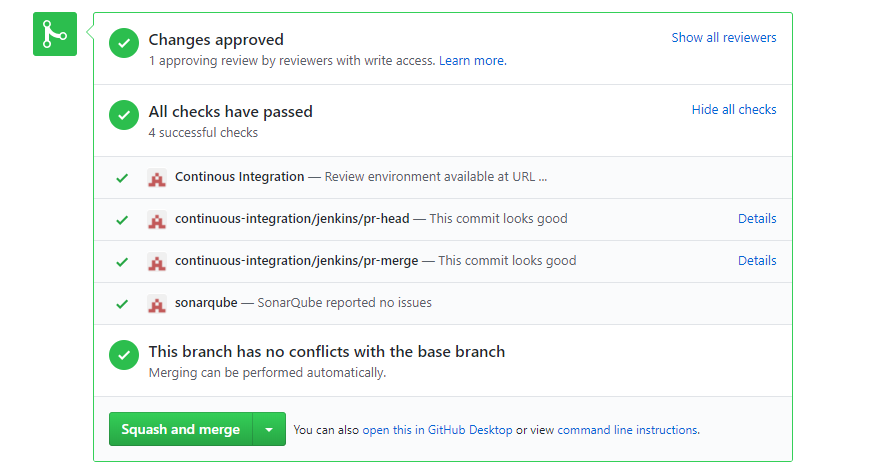

# GitHub pull request status updater

## Usage 🐳

`docker run flopes/docker-github-pull-request-status-updater <github_repository> <github_pull_request_id> <github_status_state> <github_status_description> <github_status_context> <github_token> [<github_status_target_url>]`

### Parameters
1. Repository eg. `org/repository`
2. Pull request ID
3. Pull request state (error|failure|pending|success). See GitHub [API documentation](https://developer.github.com/v3/repos/statuses/#parameters)
4. Status description
5. Context eg. `continuous-integration/jenkins`
6. GitHub API token
7. [Optional] Status target URL eg. link to Jenkins build